#android 应用程序会在以下几个时间点 创建上下文应用.
- 创建Application的时候
- 创建Activity的时候
- 创建service的时候

#android系统源代码结构
* 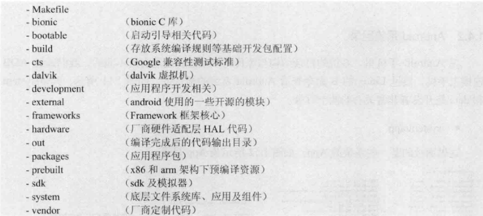
* Makefile的作用
	1. 可以自动化编译,也可以可控制编译
	2. android通过makefile来描述android各个组件的联系并指导他们进行自动化编译
#android系统目录
* /system/app 放置系统的app
* /system/bin 放置系统自带组件
* /system/build.prop 记录系统属性信息
* /system/frameword 系统核心,框架层
* /system/lib 存放所有共享库(.so)文件
* /system/media 存放系统的提示音,系统铃声
* /system/usr 保存用户的配置文件
* /data 该目录下面保存了用户绝大部分信息

#adb命令
android list targets 显示android平台
input keyevent 23 模拟键值输入

#控件架构
* ViewGroup和view形成控件树.上层控件负责下层控件的测量与绘制,并传递交互事件.通常在
Activity中使用findviewbyId方法,就是在控件树中以树的深度优先遍历来查找相应元素.
每棵控件树上面都有一个viewparent对象.

* UI界面显示图

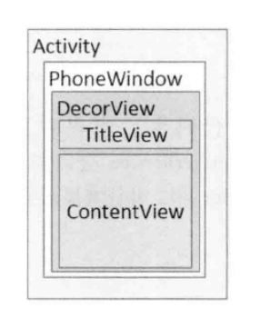

	当程序在oncreate()方法中调用setcontentview()方法的时候后,
	ActivityManagerService会回调onResume()方法,此时系统才会
	把decorView添加到PhoneWindow中,并让其显示出来,最终完成整个页面的显示

#View的测量
* android在绘制view之前,也需要对view进行测量,即告诉系统要画多大的一个view,
这个过程在onMeasure()方法中.

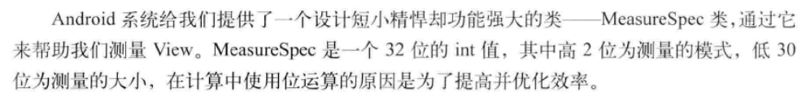

- EXCATLY

精确值模式,比如layout_width="100dp"

- AT_MOST

layout_width="wrap_content",控件的大小随着子控件或内容变化而变化,只要不超过父控件允许最大值即可.

- UNSPECIFIED

不指定测量模式,view想多大就多大,通常在绘制自定义控件时候使用.

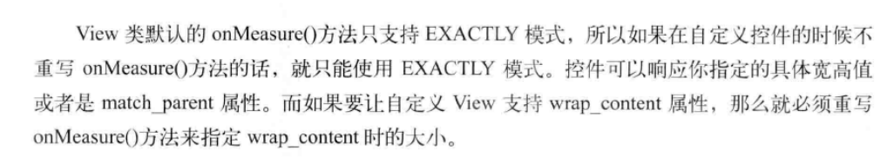

----------

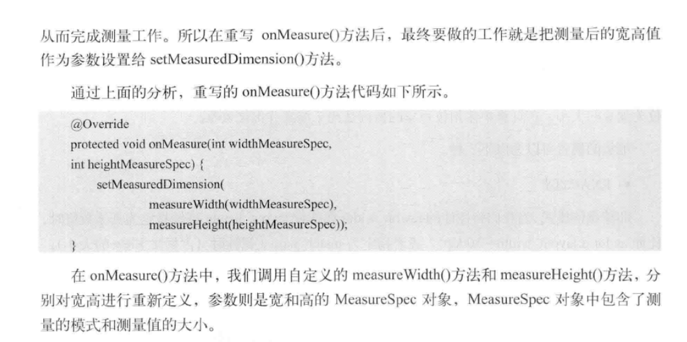

----------

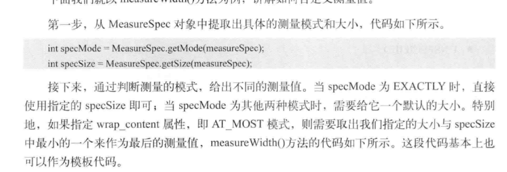

----------
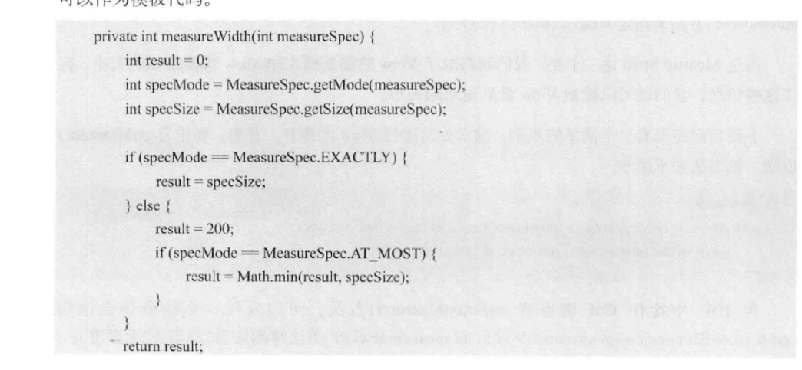

----------
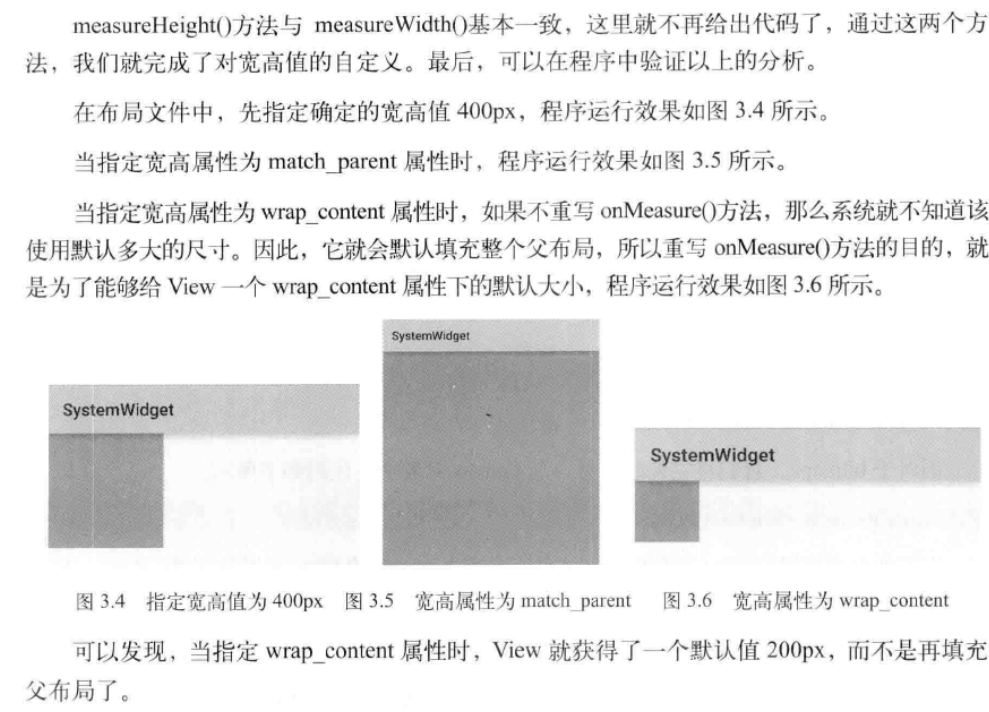

#view的绘制
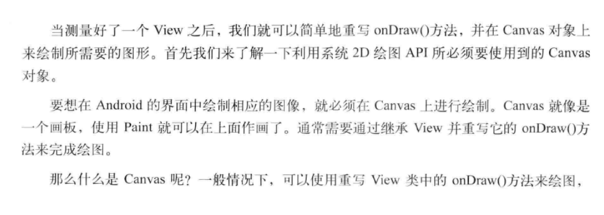
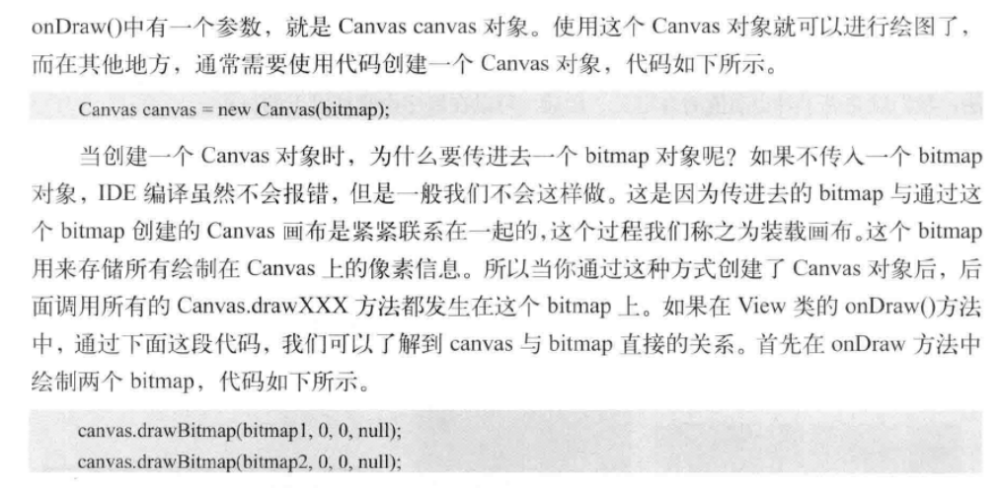
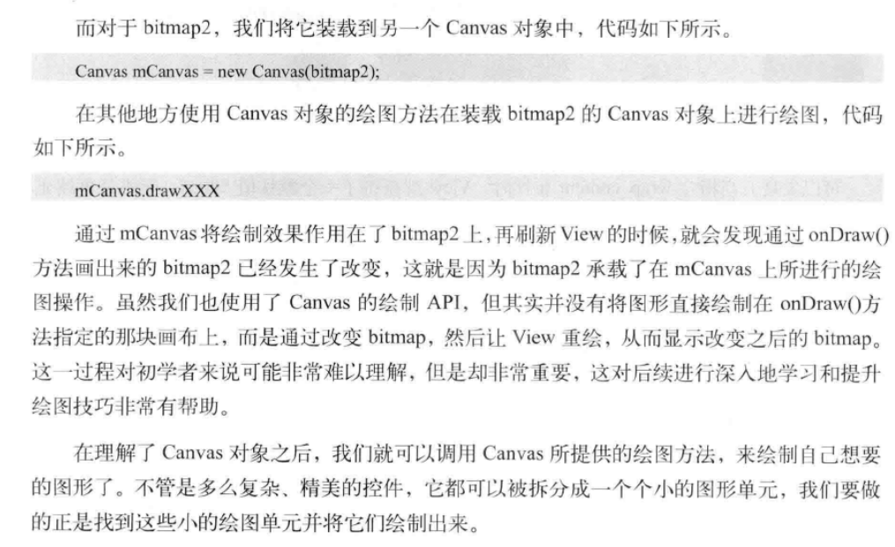

#viewgroup的测量
viewgroup会负责管理**子View**的大小
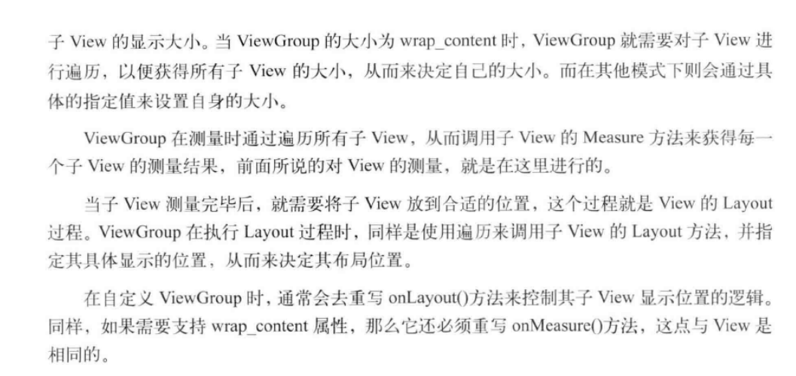

#viewgroup的绘制
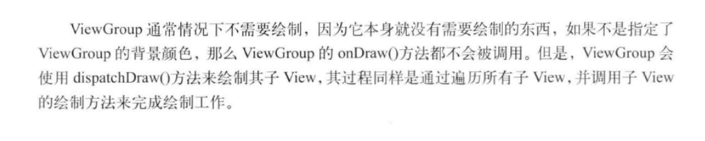