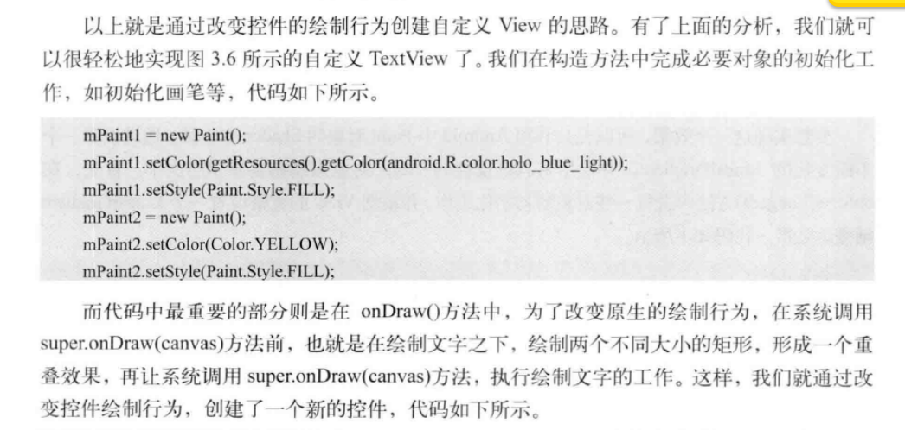

# 1 自定义view

目前通常一下有三种方法实现自定义view

1. 对现有组件进行拓张(继承)
2. 通过组合来实现新的空间
3. 重写view来实现新的空间

**注意:自定义控件需要引入多种构造方法!**

###1.1 对现有组件进行拓张

----------

示例如下:

----------
利用android 的paint对象的shader渲染器.通过设置一个不断变化的LinearGradient,并使用带有该
属性的Paint来绘制文字.

**LinearGradient:** Create a shader that draws a linear gradient along a line.

	public class ShineView extends TextView {
    private LinearGradient mLinearGradient;
    private Matrix mMatrix;
    private Paint mPaint;
    private int mViewWidth = 0;
    private int mTranslate = 0;
    public ShineView(Context context) {
        super(context);
    }

    public ShineView(Context context, AttributeSet attrs) {
        super(context, attrs);
    }

    public ShineView(Context context, AttributeSet attrs, int defStyleAttr) {
        super(context, attrs, defStyleAttr);
    }

    @Override
    protected void onSizeChanged(int w, int h, int oldw, int oldh) {
        super.onSizeChanged(w, h, oldw, oldh);
        if(mViewWidth == 0){
            mViewWidth = getMeasuredWidth();
            if (mViewWidth>0){
                mPaint = getPaint();
                mLinearGradient = new LinearGradient(0,0,mViewWidth,0,
                        new int[]{Color.BLUE,Color.WHITE,Color.BLUE},null, Shader.TileMode.CLAMP);
                mPaint.setShader(mLinearGradient);
                mMatrix = new Matrix();
            }
        }

    }

    @Override
    protected void onDraw(Canvas canvas) {
        super.onDraw(canvas);
        if (mMatrix!=null){
            mTranslate+= mViewWidth/10;
            if (mTranslate>2*mViewWidth){
                mTranslate = -mViewWidth;
            }
            mMatrix.setTranslate(mTranslate,0);
            mLinearGradient.setLocalMatrix(mMatrix);
            postInvalidateDelayed(100);
        }

    }
}

###1.2 创建复合控件
一般来说先继承viewgroup,再给它添加相应的控件,从而组合成新的复合控件.这种控件,我们一般会给他指定
一些可配置属性,让他有更强的扩展性.

####1.2.1 定义属性
 为View提供一个可定义的属性很简单,只要在res目录下的values目录里面创建一个attrs.xml的属性文件.
	
	<?xml version="1.0" encoding="utf-8"?>
	<resources>
	    <declare-styleable name="TopBar">
	        <attr name="title" format="string" />
	        <attr name="titleTextSize" format="dimension" />
	        <attr name="titleTextColor" format="color" />
	        <attr name="leftTextColor" format="color" />
	        <attr name="leftBackground" format="reference|color" />
	        <attr name="leftText" format="string" />
	        <attr name="rightTextColor" format="color" />
	        <attr name="rightBackground" format="reference|color" />
	        <attr name="rightText" format="string" />
	    </declare-styleable>
	</resources>

        // 设置topbar的背景
        setBackgroundColor(0xFFF59563);
        // 通过这个方法，将你在atts.xml中定义的declare-styleable
        // 的所有属性的值存储到TypedArray中
        TypedArray ta = context.obtainStyledAttributes(attrs,
                R.styleable.TopBar);
        // 从TypedArray中取出对应的值来为要设置的属性赋值
        mLeftTextColor = ta.getColor(
                R.styleable.TopBar_leftTextColor, 0);
        mLeftBackground = ta.getDrawable(
                R.styleable.TopBar_leftBackground);
        mLeftText = ta.getString(R.styleable.TopBar_leftText);

        mRightTextColor = ta.getColor(
                R.styleable.TopBar_rightTextColor, 0);
        mRightBackground = ta.getDrawable(
                R.styleable.TopBar_rightBackground);
        mRightText = ta.getString(R.styleable.TopBar_rightText);

        mTitleTextSize = ta.getDimension(
                R.styleable.TopBar_titleTextSize, 10);
        mTitleTextColor = ta.getColor(
                R.styleable.TopBar_titleTextColor, 0);
        mTitle = ta.getString(R.styleable.TopBar_title);

        // 获取完TypedArray的值后，一般要调用
        // recyle方法来避免重新创建的时候的错误
        ta.recycle();
最后调用ta完成资源的回收.

####1.2.2 组合控件
通过addview把三个控件放入自定义的TopBar中.
	
        mLeftButton = new Button(context);
        mRightButton = new Button(context);
        mTitleView = new TextView(context);

        // 为创建的组件元素赋值
        // 值就来源于我们在引用的xml文件中给对应属性的赋值
        mLeftButton.setTextColor(mLeftTextColor);
        mLeftButton.setBackground(mLeftBackground);
        mLeftButton.setText(mLeftText);

        mRightButton.setTextColor(mRightTextColor);
        mRightButton.setBackground(mRightBackground);
        mRightButton.setText(mRightText);

        mTitleView.setText(mTitle);
        mTitleView.setTextColor(mTitleTextColor);
        mTitleView.setTextSize(mTitleTextSize);
        mTitleView.setGravity(Gravity.CENTER);

        // 为组件元素设置相应的布局元素
        mLeftParams = new LayoutParams(
                LayoutParams.WRAP_CONTENT,
                LayoutParams.MATCH_PARENT);
        mLeftParams.addRule(RelativeLayout.ALIGN_PARENT_LEFT, TRUE);
        // 添加到ViewGroup
        addView(mLeftButton, mLeftParams);

        mRightParams = new LayoutParams(
                LayoutParams.WRAP_CONTENT,
                LayoutParams.MATCH_PARENT);
        mRightParams.addRule(RelativeLayout.ALIGN_PARENT_RIGHT, TRUE);
        addView(mRightButton, mRightParams);

        mTitlepParams = new LayoutParams(
                LayoutParams.WRAP_CONTENT,
                LayoutParams.MATCH_PARENT);
        mTitlepParams.addRule(RelativeLayout.CENTER_IN_PARENT, TRUE);
        addView(mTitleView, mTitlepParams);
#####1.2.2.1 定义接口
如何给左右两个按钮添加点击事件呢?不能直接在UI模板中直接添加逻辑,只能通过接口回调的方法
把具体实现交给调用者.

	  // 接口对象，实现回调机制，在回调方法中
    // 通过映射的接口对象调用接口中的方法
    // 而不用去考虑如何实现，具体的实现由调用者去创建
    public interface topbarClickListener {
        // 左按钮点击事件
        void leftClick();
        // 右按钮点击事件
        void rightClick();
    }
#####1.2.2.2 暴露给接口调用者
在模板中,为左右按钮添加点击事件,但不去实现具体的逻辑,而有调用接口中相应的点击方法
	
	  // 按钮的点击事件，不需要具体的实现，
        // 只需调用接口的方法，回调的时候，会有具体的实现
        mRightButton.setOnClickListener(new OnClickListener() {

            @Override
            public void onClick(View v) {
                mListener.rightClick();
            }
        });

        mLeftButton.setOnClickListener(new OnClickListener() {

            @Override
            public void onClick(View v) {
                mListener.leftClick();
            }
        });

    // 暴露一个方法给调用者来注册接口回调
    // 通过接口来获得回调者对接口方法的实现
    public void setOnTopbarClickListener(topbarClickListener mListener) {
        this.mListener = mListener;
    }
#####1.2.2.3 实现接口回调
调用者实现接口
	
	    // 获得我们创建的topbar
        mTopbar = (TopBar) findViewById(R.id.topBar);
        // 为topbar注册监听事件，传入定义的接口
        // 并以匿名类的方式实现接口内的方法
        mTopbar.setOnTopbarClickListener(
                new TopBar.topbarClickListener() {

                    @Override
                    public void rightClick() {
                        Toast.makeText(TopBarTest.this,
                                "right", Toast.LENGTH_SHORT)
                                .show();
                    }

                    @Override
                    public void leftClick() {
                        Toast.makeText(TopBarTest.this,
                                "left", Toast.LENGTH_SHORT)
                                .show();
                    }
                });

**除了可以通过接口回调来动态控制UI,也可以通过公用方法来动态控制.**

	
    /**
     * 设置按钮的显示与否 通过id区分按钮，flag区分是否显示
     *
     * @param id   id
     * @param flag 是否显示
     */
    public void setButtonVisable(int id, boolean flag) {
        if (flag) {
            if (id == 0) {
                mLeftButton.setVisibility(View.VISIBLE);
            } else {
                mRightButton.setVisibility(View.VISIBLE);
            }
        } else {
            if (id == 0) {
                mLeftButton.setVisibility(View.GONE);
            } else {
                mRightButton.setVisibility(View.GONE);
            }
        }
    }

这时候调用者,就可以动态控制了

	 // 控制topbar上组件的状态
        mTopbar.setButtonVisable(0, true);
        mTopbar.setButtonVisable(1, false);

#####1.2.2.4 引入模板
如果要引入第三方控件,需要创建自己的命名空间,在as中,第三方控件的引入都是通过如下代码:

	xmlns:custom="http://schemas.android.com/apk/res-auto"

这里命名为custom,之后在XML文件使用自定义属性时候,通过这个命名空间引用
注意需要自定义控件需要完整的包名
	
	<com.imooc.systemwidget.TopBar
        android:id="@+id/topBar"
        android:layout_width="match_parent"
        android:layout_height="40dp"
        custom:leftBackground="@drawable/blue_button"
        custom:leftText="Back"
        custom:leftTextColor="#FFFFFF"
        custom:rightBackground="@drawable/blue_button"
        custom:rightText="More"
        custom:rightTextColor="#FFFFFF"
        custom:title="自定义标题"
        custom:titleTextColor="#123412"
        custom:titleTextSize="10sp"/>

再进一步,将UI模板写到一个布局文件中
	
	<com.xys.mytopbar.Topbar 
		xmlns:android="http://schemas.android.com/apk/res/android"
	    xmlns:custom="http://schemas.android.com/apk/res-auto"
	    android:id="@+id/topBar"
	    android:layout_width="match_parent"
	    android:layout_height="40dp"
	    custom:leftBackground="@drawable/blue_button"
	    custom:leftText="Back"
	    custom:leftTextColor="#FFFFFF"
	    custom:rightBackground="@drawable/blue_button"
	    custom:rightText="More"
	    custom:rightTextColor="#FFFFFF"
	    custom:title="自定义标题"
	    custom:titleTextColor="#123412"
	    custom:titleTextSize="15sp">
	</com.xys.mytopbar.Topbar>

再通过
	<include layout="@layout/topbar" /> 
调用.进一步实现解耦.