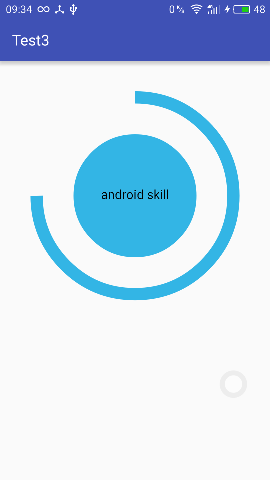
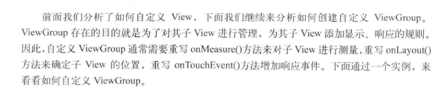
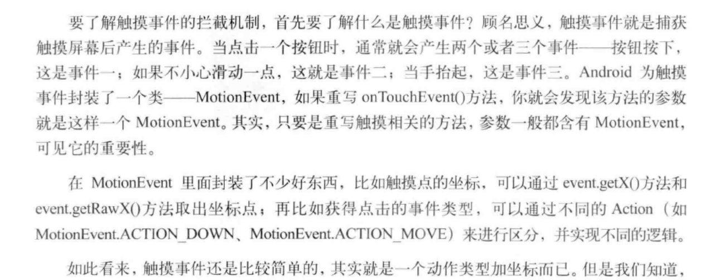
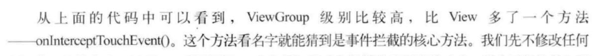
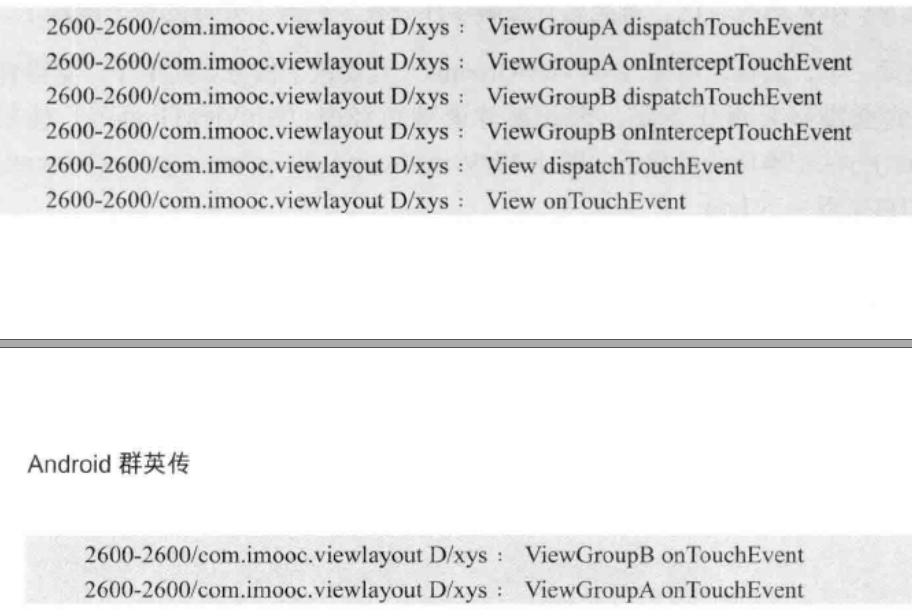
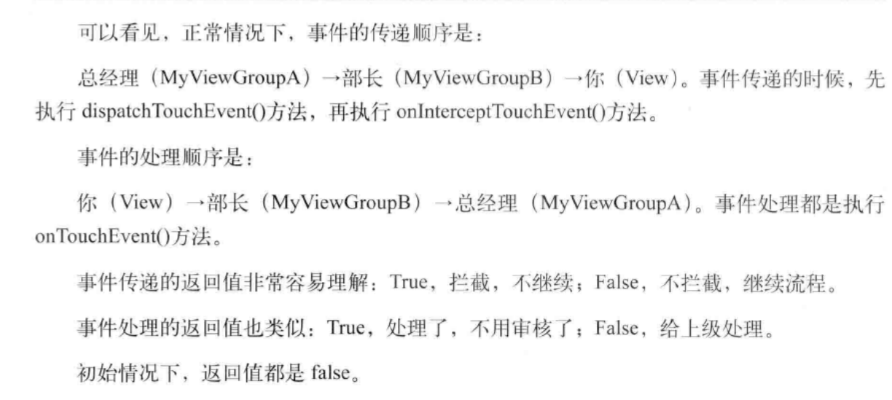

#创建自定义控件
难点在于绘制和实现交互.
通常需要继承View类,并重写它的onDraw(),onMeasure()等方法实现绘制逻辑
通过重写onTouchEvent()等触控时间实现交互逻辑,也可以引入自定义属性.

##定义一个弧形展示图

很明显这个自定义View分为三个部分:中间圆形,中间显示文字,外圈的弧线

绘制弧线需要指定椭圆的外接矩形.

其实,所有自定义View都是由基本图形组合而成,关键在于如何分解,设计这些图形.
具体代码实现如下:
	
	public class CircleProgressView extends View {

	    private int mMeasureHeigth;
	    private int mMeasureWidth;
	
	    private Paint mCirclePaint;
	    private float mCircleXY;
	    private float mRadius;
	
	    private Paint mArcPaint;
	    private RectF mArcRectF;
	    private float mSweepAngle;
	    private float mSweepValue = 66;
	
	    private Paint mTextPaint;
	    private String mShowText;
	    private float mShowTextSize;
	
	    public CircleProgressView(Context context, AttributeSet attrs,
	                              int defStyleAttr) {
	        super(context, attrs, defStyleAttr);
	    }
	
	    public CircleProgressView(Context context, AttributeSet attrs) {
	        super(context, attrs);
	    }
	
	    public CircleProgressView(Context context) {
	        super(context);
	    }
	
	    @Override
	    protected void onMeasure(int widthMeasureSpec,
	                             int heightMeasureSpec) {
	        mMeasureWidth = MeasureSpec.getSize(widthMeasureSpec);
	        mMeasureHeigth = MeasureSpec.getSize(heightMeasureSpec);
	        setMeasuredDimension(mMeasureWidth, mMeasureHeigth);
	        initView();
	    }
	
	    @Override
	    protected void onDraw(Canvas canvas) {
	        super.onDraw(canvas);
	        // 绘制圆
	        canvas.drawCircle(mCircleXY, mCircleXY, mRadius, mCirclePaint);
	        // 绘制弧线
	        canvas.drawArc(mArcRectF, 270, mSweepAngle, false, mArcPaint);
	        // 绘制文字
	        canvas.drawText(mShowText, 0, mShowText.length(),
	                mCircleXY, mCircleXY + (mShowTextSize / 4), mTextPaint);
	    }
	
	    private void initView() {
	        float length = 0;
	        if (mMeasureHeigth >= mMeasureWidth) {
	            length = mMeasureWidth;
	        } else {
	            length = mMeasureHeigth;
	        }
	
	        mCircleXY = length / 2;
	        mRadius = (float) (length * 0.5 / 2);
	        mCirclePaint = new Paint();
	        mCirclePaint.setAntiAlias(true);
	        mCirclePaint.setColor(getResources().getColor(
	                android.R.color.holo_blue_bright));
	
	        mArcRectF = new RectF(
	                (float) (length * 0.1),
	                (float) (length * 0.1),
	                (float) (length * 0.9),
	                (float) (length * 0.9));
	        mSweepAngle = (mSweepValue / 100f) * 360f;
	        mArcPaint = new Paint();
	        mArcPaint.setAntiAlias(true);
	        mArcPaint.setColor(getResources().getColor(
	                android.R.color.holo_blue_bright));
	        mArcPaint.setStrokeWidth((float) (length * 0.1));
	        mArcPaint.setStyle(Style.STROKE);
	
	        mShowText = setShowText();
	        mShowTextSize = setShowTextSize();
	        mTextPaint = new Paint();
	        mTextPaint.setTextSize(mShowTextSize);
	        mTextPaint.setTextAlign(Paint.Align.CENTER);
	    }
	
	    private float setShowTextSize() {
	        this.invalidate();
	        return 50;
	    }
	
	    private String setShowText() {
	        this.invalidate();
	        return "Android Skill";
	    }
	
	    public void forceInvalidate() {
	        this.invalidate();
	    }
	
	    public void setSweepValue(float sweepValue) {
	        if (sweepValue != 0) {
	            mSweepValue = sweepValue;
	        } else {
	            mSweepValue = 25;
	        }
	        this.invalidate();
	    }
	}
##动态的view

完成了静态效果的绘制,那么如何实现动态效果呢?只需要要在ondraw()方法里调用invalidate()方法
通知View进行重绘.不过,不需要每一次完成就通知View进行重新绘制.这样会刷新太快影响效果.
因此,可以通过以下方法延迟View绘制.

	postInvalidateDelayed()

#自定义ViewGroup

	
#事件拦截分发机制

----------

----------

----------

